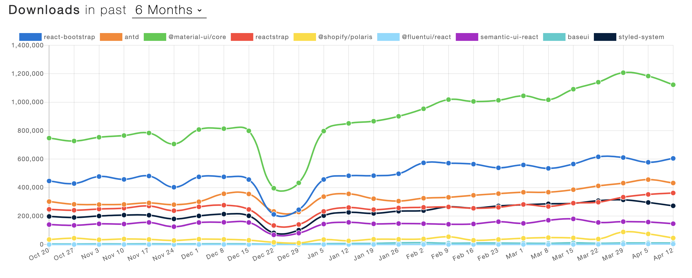

# React Landing Page

This React UI component library for building Landing Pages is **deprecated for the time being**.

I deprecated it because a lot has changed in the industry over the past few years and my vision of the problem this repo was trying to solve has changed as well.

On one hand, there is no need to couple your app to your landing page. If your app is using react, it does not mean your landing page should. If anything, react is slowing down your landing page.

> JavaScript bundle size reduced by 200kB by switching from React and other client-side libraries to vanilla JavaScript. React was still used server-side.

[A Netflix web performance study](https://medium.com/dev-channel/a-netflix-web-performance-case-study-c0bcde26a9d9)

On the other hand, you may be tempted to re-use the UI library you used to build your app to have the same look. This makes a lot of sense. Except you should not build your app before you build your landing page :D

In this case, you either have your custom-built UI library and you are basically on your own to build your landing page. Or you chose to go with an off-npm UI library, such as Material UI, React Bootstrap, Reactstrap, or Antd.

[Material UI](https://material-ui.com/) has an [official store](https://material-ui.com/store) and there is one [landing page template](https://material-ui.com/store/items/onepirate/). *Someone should make more :D*

[React Bootstrap](https://react-bootstrap.github.io/) does not have a store or anything. They migrated to Bootstrap v4 not that long ago. *Someone should make a react-bootstrap.store (even domain name is available) :D*

As I said, it took React Bootstrap a few years to migrate to Bootstrap v4, and in the meantime, [Reactstrap](https://reactstrap.github.io/) came to life. There is a [Reactstrap templates page](https://reactstrap.github.io/premium-themes/) and link to a [third party store](https://uifort.com/template/bamburgh-react-ui-kit-reactstrap-free/).

And finally, there is [Ant.design](https://ant.design/), which has a whole [collection of landing pages](https://landing.ant.design/), make sure to check it out. It's cool! There really should be something like this for every other UI lib.

Hopefully, this was useful. Star it if you found it useful :D

